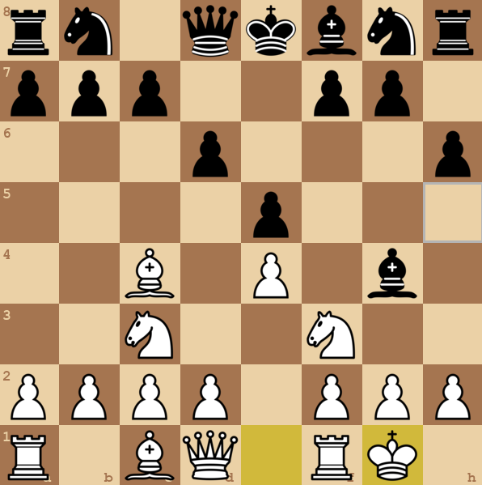

# 👑♟️ Chess game

## 🔍 Overview

Chess is a two-player strategic board game played on a 64-square checkered board. Each player controls an army of pieces, all with unique moves. The goal of the game is to checkmate your opponent's king, meaning you've put it in a position where it can be captured and has no escape, while simultaneously safeguarding your own. Chess is well-known for its intricate nature, demanding critical thinking, foresight, and tactical skill from its players.


## 📁 Project Structure

```text
chessgame/
├── assets/
│   ├── images/
│   │   ├── {piece_name}.png   # Picture of specific pieces
│   └── sounds/
│       ├── capture.wav        # Sound when pieces are captured
│       └── move.wav           # Sound when move one piece
├── snapshot/                  # Picture of chessboard
├── source/
│   └── file.py                # Source code of the project
├──files.txt                   # Chess record sheet
├──README.md                   # Project overview and metadata
├──.gitignore                  # Files ignored by Git
└── requirements.txt           # External Python packages your project needs to run
```

## 📌 Objectives

- Spot and carry out sequences of tatics that lead to a material win, **checkmate**, or a decisive positional advantage
- Prioritize the safety of your **King** and do not be so greedy
- Look for vulnerabilities of your opponent's position, discover their **blunders** and develop your own move
- Carefully make your decisive move and **brilliant** move to force your opponent into a trap  


## 🧰 Tools and Technologies

- Visual Studio Code

## 📕 Language
- Python 
  

## 🎮 Game Snapshot

 <div align="center">
   
 </div>

## 📄 List of game features
- **Standard Chess Gameplay:** Support all chess rules, including piece movements, captures, castling, en passant and pawn promotion.
- **Graphical Interface:** Render an 8x8 chessboard using Pygame with piece display, valid move highlights, last move indicators, hover effects and row/column labels.
- **Piece Dragging:** Enable piece dragging with highlighted valid move squares.
- **Game State Management:** Track player turns, game status, and detects end conditions such as checkmate, draw by stalemate, threefold repetition, 50-move rule, insufficient material and resignation.
- **PGN Recording:** Record moves in SAN format and saves them to a .txt file.
- **Sound Effects:** Play audio for piece movements and captures.
- **User Controls:** Offer mouse dragging for moves and keyboard inputs (C for theme change, R to resign, N for new game, Q to quit) with a result popup.
- **Promotion Handling:** Give player some options to select a piece (Queen, Rook, Knight, Bishop) when a pawn reaches the opponent’s back rank.
- **Error Handling:** Catch and prevent illegal moves.
## 🕹️ Instructions
- Drag a piece to move it
- Press button `n` to start a new game
- Press button `c` to change the theme of the chessboard
- Press button `r` to resign
- Press button `q` to quit the game

## 👥 Author

  **Thanh Phong**

## 🤖 Project Setup
### Global Environment Setup
1. Install Python: <br>
Download and install Python (version 3.8 or higher).
2. Clone, fork or download the project:
- Open Command Prompt (CMD) or Terminal
```
git clone https://github.com/phongthanh1412/Chess-game.git
```
- Navigate to your project
```
cd ~\Chessgame
```
3. Install dependencies
```
pip install -r requirements.txt
```
### Virtual Environment Setup
1. Install Python: <br>
Download and install Python (version 3.8 or higher).
2. Clone, fork or download the project: <br>
- Open Command Prompt (CMD) or Terminal.
```
git clone https://github.com/phongthanh1412/Chess-game.git
```
- Navigate to your project
```
cd ~\Chessgame
```
3. Set up a virtual environment
```
python -m venv venv
```
4. Activate virtual environment
```
venv\Scripts\activate
```
5. Deactivate virtual environment
```
deactivate
```
6. Install dependencies
```
pip install -r requirements.txt
```
### Run Code
1. Navigate to the project 
```
cd ~\Chessgame
```
2. Two-player mode <br>
- Server <br>
```
python source/server.py
```
- Client
```
python source/client.py
```
3. One player mode
```
python source/main.py
```
## ⛑️Issues
- In two-player mode: `en_passant`, `promotion` did not work accurately.
  + En passant: The en passant move is not recognized or executed correctly. Pawns cannot perform en passant captures as expected.
  + Promotion: Pawn promotion does not always work as intended. The promotion popup appears on both sides, or the promoted piece is not updated correctly on the opponent's board.
- If you discover solutions or improvements to these issues, contribute and help build a truly polished chess experience. Thank you!
## 🚇 Demo
- https://drive.google.com/file/d/1GPak9i4aB9l3Ye8O9zzhsMkNdcjVddSh/view?usp=drive_link
## 📚 Appendix 
### Modules
- `pygame` is used for developing the game interface such as creating the game window, handling input...
- `os` accesses operating system functions like file paths.
- `sys` provides access to system-level functions.
- `copy` creates copies of objects especially deep copies like board states.
- `datetime` manages date and time information when recording game time or move timestamps
### References
- https://www.chess.com/learn-how-to-play-chess
- https://github.com/AlejoG10/python-chess-ai-yt
